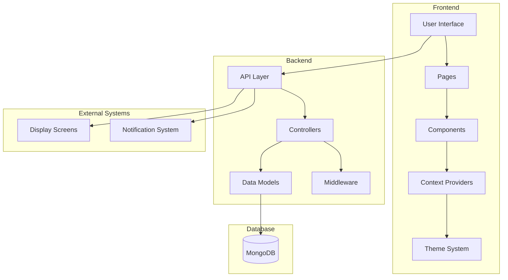

# HospitAll System Architecture

## System Architecture Diagram

## Architecture Components

### Frontend
- **User Interface**: Main application interface
- **Pages**: Route-based page components
- **Components**: Reusable UI components
- **Context Providers**: State management
- **Theme System**: UI styling and theming

### Backend
- **API Layer**: RESTful API endpoints
- **Controllers**: Business logic handlers
- **Data Models**: Database schemas
- **Middleware**: Authentication and validation

### Database
- **MongoDB**: Primary data storage

### External Systems
- **Display Screens**: Hospital display integration
- **Notification System**: Real-time alerts and updates 
