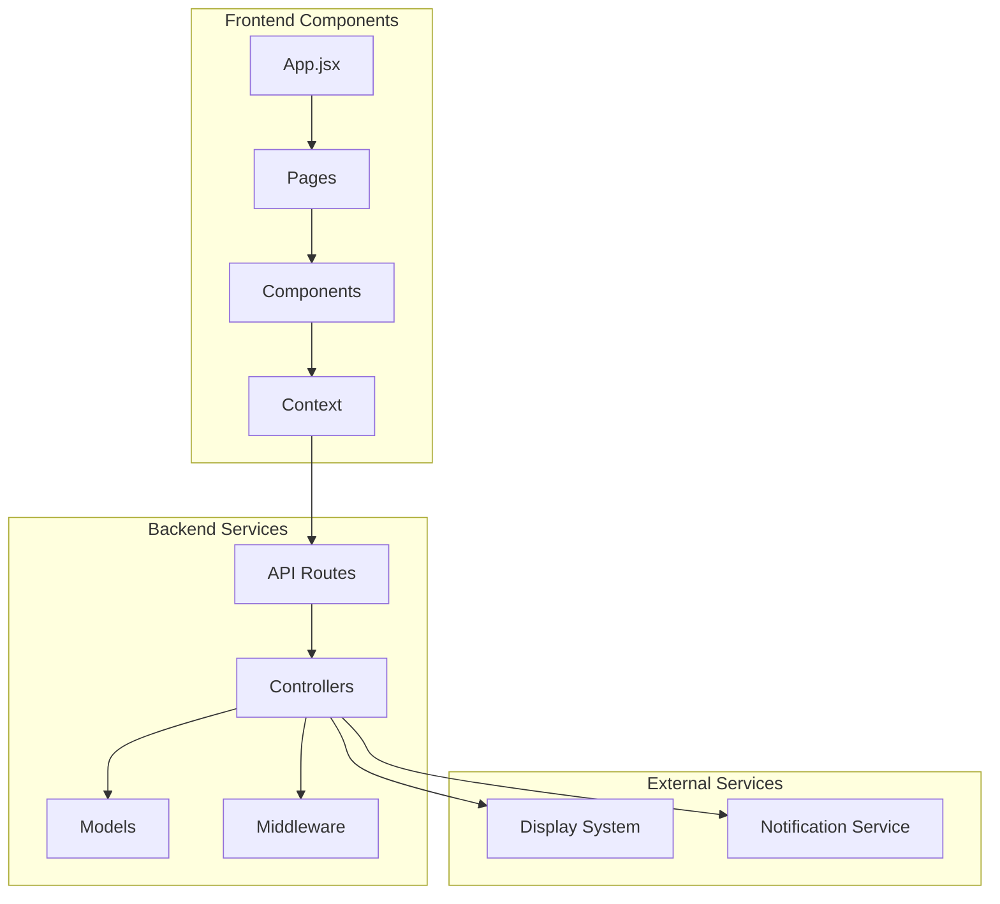

# HospitAll Component Interaction

## Component Interaction Diagram

## Component Interaction Details

### Frontend Components
1. **App.jsx**
   - Main application entry point
   - Route configuration
   - Global state initialization

2. **Pages**
   - Route-based components
   - Page-specific logic
   - Layout management

3. **Components**
   - Reusable UI elements
   - State management
   - Event handling

4. **Context**
   - Global state management
   - Data sharing
   - Theme configuration

### Backend Services
1. **API Routes**
   - Endpoint definitions
   - Request routing
   - Response handling

2. **Controllers**
   - Business logic
   - Data processing
   - Service coordination

3. **Models**
   - Data structure
   - Database schema
   - Validation rules

4. **Middleware**
   - Authentication
   - Authorization
   - Request processing

### External Services
1. **Display System**
   - Screen management
   - Content updates
   - Real-time display

2. **Notification Service**
   - Alert management
   - Message delivery
   - Status updates

## Interaction Patterns
- Unidirectional data flow
- Event-driven communication
- Real-time updates
- Secure data transmission
- Error handling
- State synchronization 