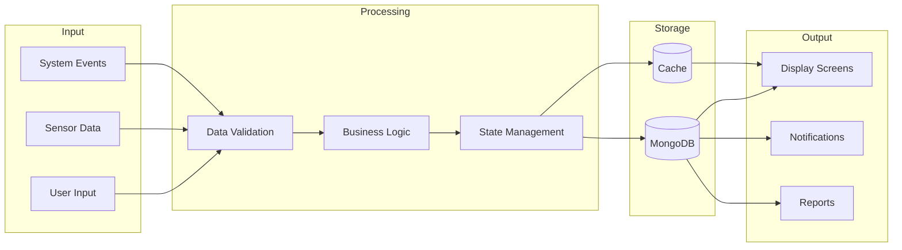

# HospitAll Data Flow

## Data Flow Diagram

## Data Flow Components

### Input Layer
- **User Input**: Patient data, staff actions, admin commands
- **Sensor Data**: Real-time monitoring data
- **System Events**: Automated triggers and alerts

### Processing Layer
- **Data Validation**: Input verification and sanitization
- **Business Logic**: Application rules and workflows
- **State Management**: System state handling

### Storage Layer
- **MongoDB**: Primary data storage
- **Cache**: Temporary data storage for performance

### Output Layer
- **Display Screens**: Real-time information display
- **Notifications**: Alert system
- **Reports**: Data analytics and reporting

## Data Flow Characteristics
- Real-time data processing
- Bidirectional data flow
- Caching for performance optimization
- Event-driven updates
- Secure data transmission 