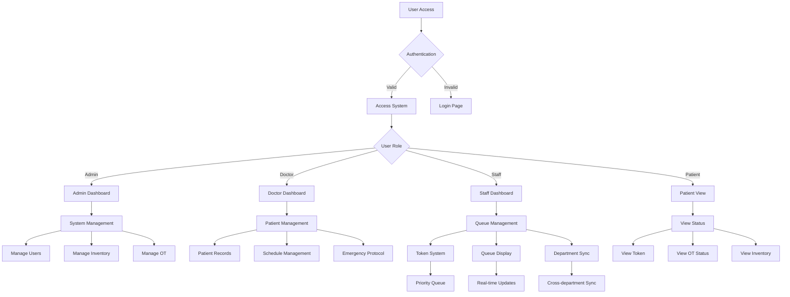

# HospitAll System Flow

## System Flow Diagram

## Flow Components

### Authentication Flow
- User access validation
- Role-based access control
- Session management

### User Role Flows
1. **Admin Flow**
   - System management
   - User management
   - Inventory control
   - OT management

2. **Doctor Flow**
   - Patient records
   - Schedule management
   - Emergency protocols

3. **Staff Flow**
   - Queue management
   - Token system
   - Department synchronization

4. **Patient Flow**
   - Status viewing
   - Token tracking
   - OT status monitoring

### System Features
- Priority queue management
- Real-time updates
- Cross-department synchronization
- Emergency protocols
- Inventory management 